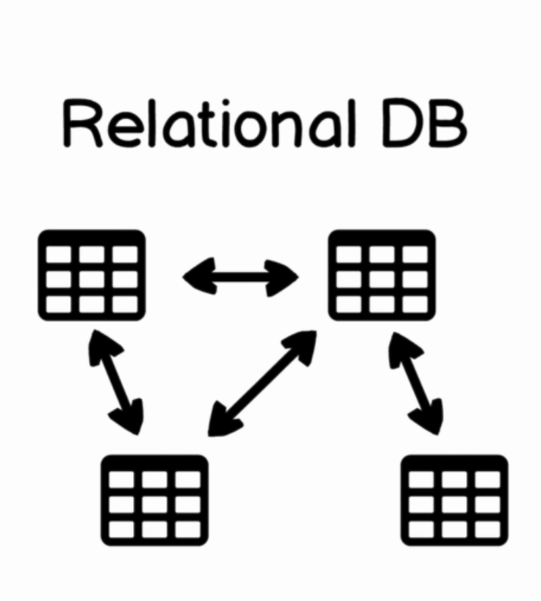
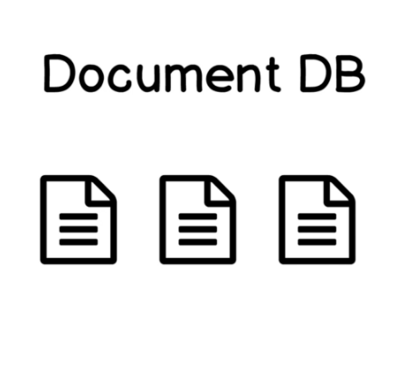
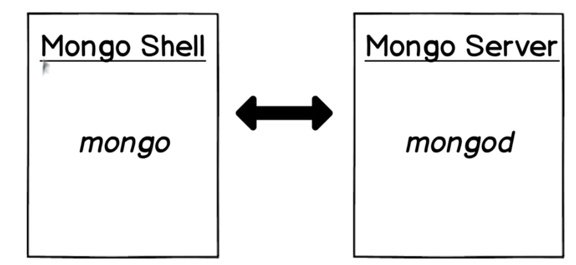
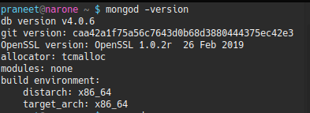
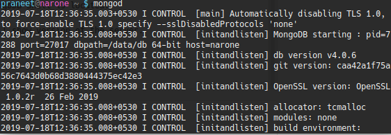
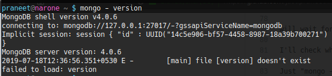
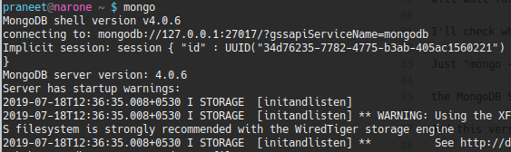
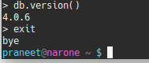

# MongoDB
It is based on javascript and uses Mozilla's SpiderMonkey Javascript engine.

__*There are two common type of database present :*__
- __Relational Database OR SQL Database__

    - In SQL Database data is stored in different tables and those tables have different schema.
      data stored in the table have relations such as one to one ,one to many and many to one or many to many.
      And in order to retrive some data we perfom join operations/requests that combines data from different table.
    - __Examples :__
        -     MySQl.
        -     Oracal Database.

    

- __Document Database OR NoSQl Databse__
    - In this the data is stored in different documents and each document is independent from other.
      And it is not mandatory for documents to have same schema for the database.
      for example some documents in database may have field called `marks` but other documents in the database may not have same
      field.
      All information related to the document is stored in one document,in one place.
      No need to use join operations. And the documents in database can be edited independent from others you can insert
      new documents and delete documents and so on.
     - __Examples :__
        -     NOSQl.
        -     MongoDB.
    

## MongoDB Structure

Each MongoDB database consists of databases. There are default databases that are created after
each installation of the MongoDB. And they are called for example admin and local. Each database consists of
the collections and each collection consists of the documents.
Usually documents are grouped into the same collection by common fields.
Let's suppose that you want to create e-commerce web application. And you'll create a database called "e-commerce store".
And you will probably create such collections as "products", "productCategories", "shoppingCart",
"customers" and so on.
Again schema is flexible and it is not mandatory to have same set of fields in the documents in the same collection.
That is the structure of each MongoDB database.

## Mongo shell and Server
`"mongod"` command is used to launch MongoDB Server and `"mongo"` command is used to launch MongoDB Shell.
Those two applications are separate but what those two applications do? MongoDB Server stores data in the MongoDB
database.
It is the main point of data storage. And mongo shell is used for management of the mongo server. Using mongo
shell you can insert documents into the mongo server, you can update documents, you can delete documents
and so on.
In other words you can perform all kinds of CRUD operations -
Create, Read, Update and Delete.
And that is a mongo shell. Both mongo shell and mongo server are based on the JavaScript engine. In order to manage MongoDB Server you can use mongo shell located on the same computer.
But you can also manage remote mongo server using local mongo shell. For example you can connect to remote
MongoDB Server using MongoDB Shell installed on your local computer.
    
 
 - __Working__
 
After successfully installed MongoDB Server on your local computer.

let's launch it and connect to it from MongoDB Shell.

First you should check whether "mongodb"

command is available in your shell. If it is available

you can check for example version of the MongoDB Server. Type "mongod -version". 

And on my computer I have installed latest version.

It is 4.0.6.

In your case it may be something larger than this one.

Let's start MongoDB Server.

Just "mongod" and Enter. And if everything is fine then you will see that server was started and server

will wait for connections on port 27017.

In the other terminal window  check whether "mongo" command is available and we can also check version of the MongoDB Shell.

Just "mongo -version". Version of the mongo shell on my computer is the same as the version of

the MongoDB Server because I have installed them as one package.

And this version is 4.0.6.

Let's start MongoDB Shell. Just "mongo" command and enter. And here it is.

I have successfully connected to the MongoDB Server.

No username and password.

was asked because MongoDB was installed on the same computer where this MongoDB Shell is located.

And here I can use for example "db.version()" command. And this command will show version of the server.

And it is Version 4.0.6. 

