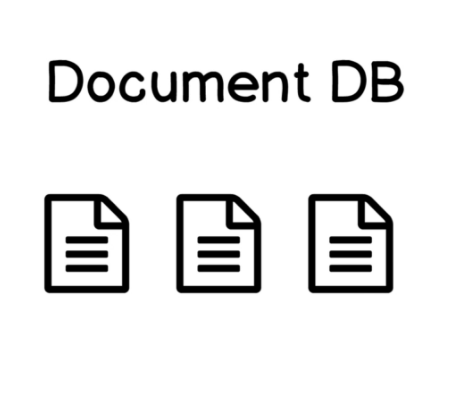

# MongoDB
It is based on javascript and uses Mozilla's SpiderMonkey Javascript engine.

__*There are two common type of database present :*__
- __Relational Database OR SQL Database__

    - In SQL Database data is stored in different tables and those tables have different schema.
      data stored in the table have relations such as one to one ,one to many and many to one or many to many.
    - __Examples :__
        -     MySQl.
        -     Oracal Database.

    

- __Document Database OR NoSQl Databse__
    

